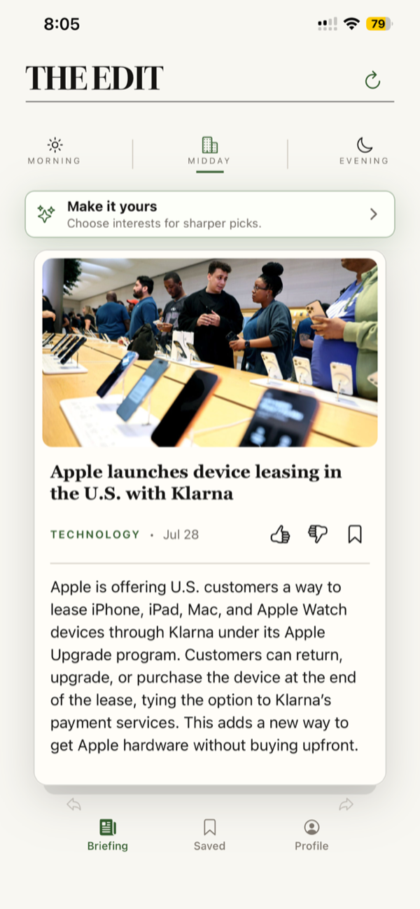
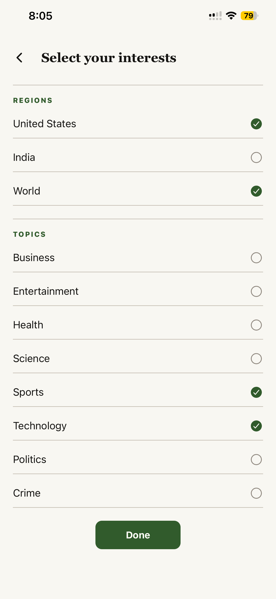
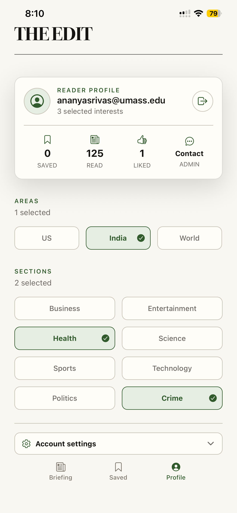
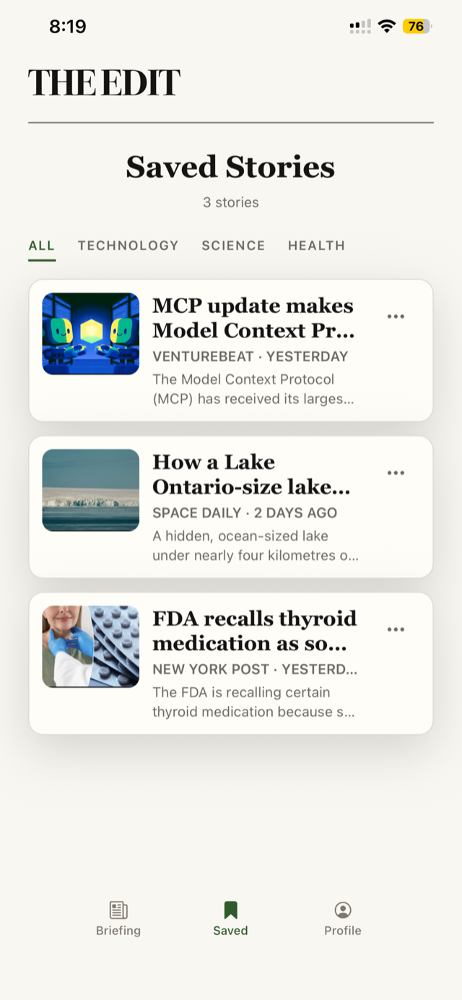
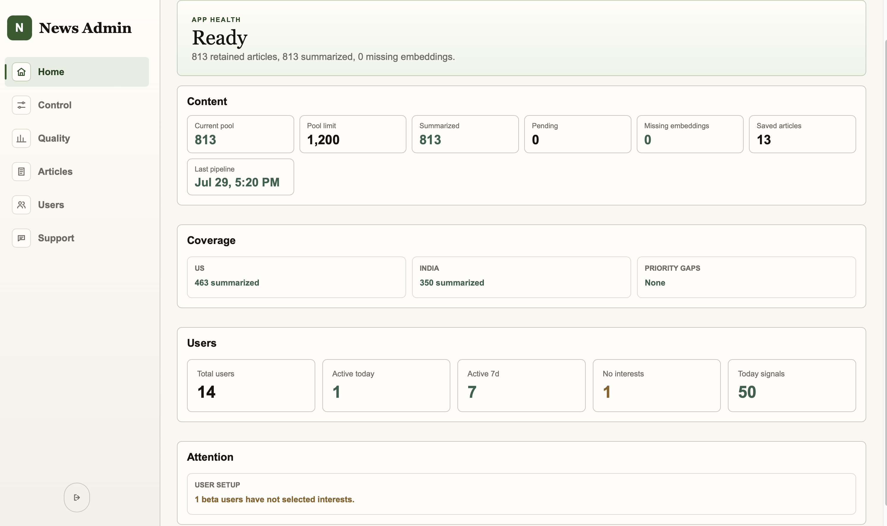
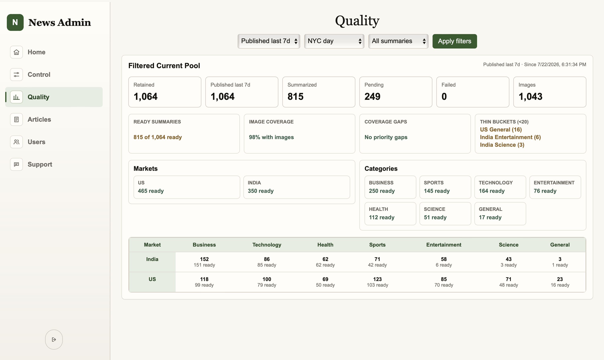
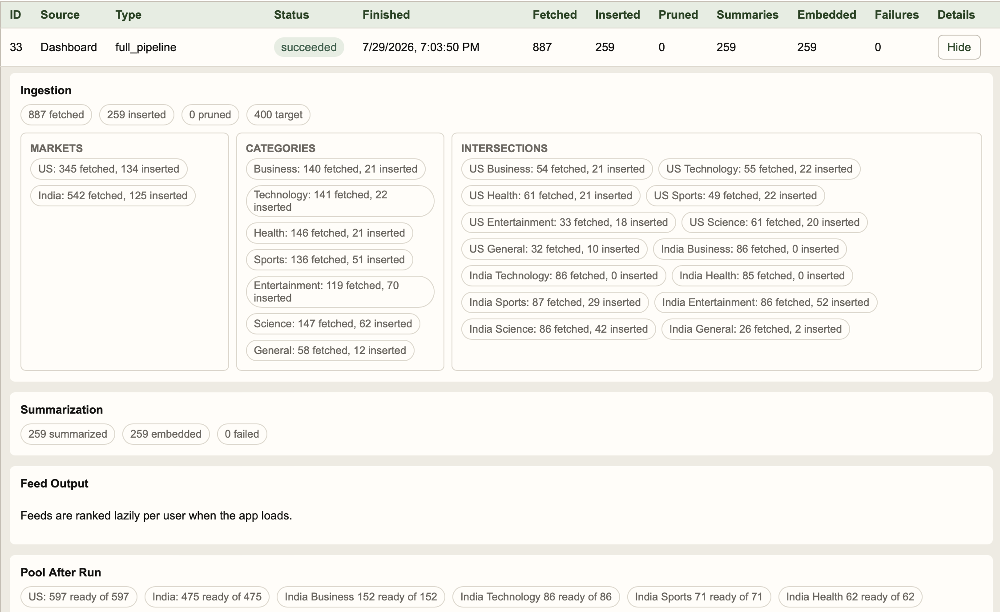
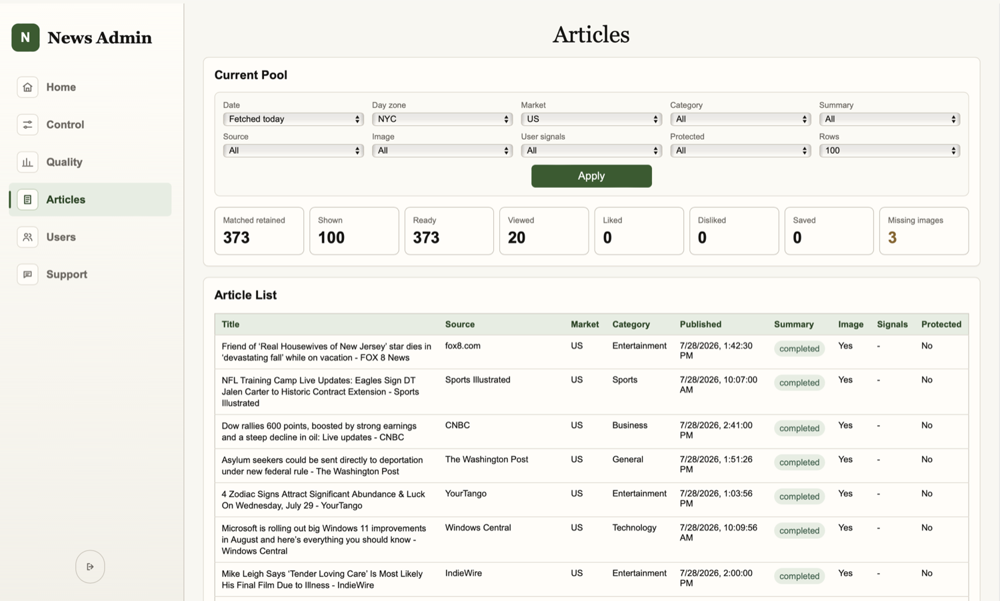
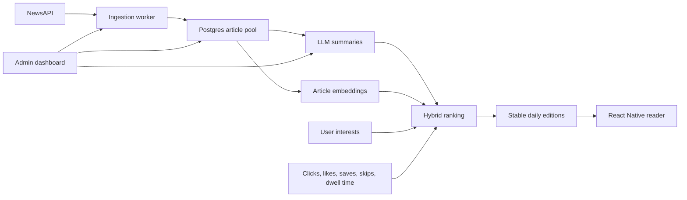

# Personalized News Recommendation Platform

**FastAPI, PostgreSQL, Celery, Redis, React Native, Vector Search**

**The Edit** is a full-stack personalized news platform built with **FastAPI,
PostgreSQL, Celery, Redis, React Native, and embedding-based vector similarity**.
It turns live news into swipeable flashcard briefings, learns from reader
signals, and gives an admin a real control room for the ingestion and
summarization pipeline.

- Built a personalized news recommendation platform that generates daily article rankings and flashcard-style summaries using user interests, behavioral signals, content features, and embedding-based retrieval.
- Designed an asynchronous content pipeline for article ingestion, deduplication, keyword extraction, embedding generation, and LLM-based summarization using Celery and Redis.
- Implemented a hybrid ranking and reranking pipeline combining explicit interests, behavioral signals, recency decay, keyword features, and embedding similarity to score candidates, suppress duplicates, and improve feed diversity.
- Built user-feedback pipelines that capture clicks, likes, saves, skips, and dwell time to continuously update preference profiles and improve ranking quality.

## Product Demo

### Mobile Reader

The mobile app is designed to feel like a fast editorial product, not a generic
feed. Readers swipe through Morning, Midday, and Evening editions; images are
prefetched ahead of the current card; and every interaction updates the user's
preference profile.

<p>
  
  
  
  
</p>

### Admin Dashboard

The private dashboard turns the app into an operable system. It tracks article
supply, summary coverage, image coverage, market/category gaps, recent pipeline
runs, beta users, and support messages.









## Why It Matters

Most portfolio apps stop at CRUD. This project has the parts that make a real
content product difficult:

- **Fresh content pipeline:** NewsAPI ingestion, validation, deduplication, category correction, keyword extraction, pruning, and quota-aware pool management.
- **LLM summarization:** OpenAI-powered concise summaries shaped for fixed mobile cards, with fallback summaries for local development.
- **Vector-aware ranking:** Article and user embeddings feed semantic similarity into the ranking score.
- **Hybrid recommender:** Explicit interests, market preferences, keyword signals, dwell time, saves, likes, skips, recency, and diversity constraints are combined into one feed.
- **Fast mobile UX:** Card images are prefetched 12 stories ahead and 4 behind with `expo-image` memory/disk caching, so swiping stays responsive.
- **Operator tooling:** Admins can run pipelines, inspect quality, create beta users, reset passwords, delete accounts, review support messages, and understand why content is or is not ready.

## How It Works



1. Celery jobs fetch fresh articles by country and category.
2. Articles are cleaned, deduplicated by URL/story key, categorized, and stored.
3. Pending articles are summarized and embedded.
4. The recommender scores candidates using interest matches, country/category preferences, recency, keywords, previous behavior, and embedding similarity.
5. A reranker improves feed diversity by balancing markets, categories, sources, and duplicate-like stories.
6. Reader interactions are logged back into the preference system.

## Core Features

### Reader App

- Beta email/password login with persisted sessions.
- Three daily editions: Morning Brief, Midday Catch-Up, and Daily Digest.
- Swipeable flashcard UI with headline, image, metadata, summary, like, dislike, and save actions.
- Instant-feeling image loading with `expo-image` prefetching and memory/disk cache.
- Interest setup by region and topic.
- Saved stories screen with category filters.
- Profile page with reading stats, selected interests, account actions, and admin contact.

### Backend And Pipeline

- FastAPI API with SQLAlchemy models and Alembic migrations.
- PostgreSQL article pool with summaries, embeddings, flashcards, interactions, users, and support messages.
- Celery + Redis background workers for ingestion, summarization, embeddings, and scheduled editions.
- Configurable pipeline limits. Current defaults use a 1,200 article pool and a 400 article target per run.
- Duplicate suppression by URL and story-key similarity.
- Freshness controls so stale articles only backfill when fresh supply is thin.

### Admin Dashboard

- Pipeline controls for full refreshes, ingestion-only runs, and summarization-only runs.
- Health overview for retained articles, summaries, embeddings, users, saved articles, and attention items.
- Quality dashboard for market/category coverage, missing images, pending summaries, and thin buckets.
- Article browser with filters for market, category, source, date, summary status, image status, signals, and protected articles.
- User management for beta accounts, password resets, and account deletion.
- Support inbox for authenticated reader messages.

## Tech Stack

- **Mobile:** Expo, React Native, TypeScript, Expo Router, `expo-image`.
- **Dashboard:** React, TypeScript, Vite.
- **Backend:** FastAPI, SQLAlchemy, Alembic, Pydantic.
- **Jobs:** Celery, Redis.
- **Database:** PostgreSQL.
- **AI/content:** NewsAPI, OpenAI summaries, OpenAI embeddings, deterministic fallback summaries.
- **Testing:** Pytest backend contracts, ranking tests, feed edition tests, summarizer tests, frontend TypeScript/lint checks.

## Repository Layout

```text
backend/    FastAPI API, database models, Celery tasks, ranking, summarization
frontend/   Expo mobile reader app
dashboard/  React admin dashboard
docs/       Extra technical notes and README assets
```

## Local Setup

Clone the repo and create env files:

```bash
cp backend/.env.example backend/.env
cp dashboard/.env.example dashboard/.env
cp frontend/.env.example frontend/.env
```

Fill `backend/.env` with local secrets. At minimum:

```bash
SECRET_KEY="dev-change-me"
NEWS_API_KEY="your_newsapi_key"
ADMIN_EMAILS="admin@example.com"
ADMIN_BOOTSTRAP_EMAIL="admin@example.com"
ADMIN_BOOTSTRAP_PASSWORD="ChangeMe123"
ENABLE_PUBLIC_SIGNUP="false"
```

The bootstrap admin user is created or updated when the backend starts.

## Run The Backend

```bash
cd backend
docker compose up --build -d
docker compose exec web alembic upgrade head
docker compose exec web python app/db/scripts/initial_data.py
```

Useful local API URLs:

- API health: `http://localhost:8000/health`
- API docs: `http://localhost:8000/docs`

## Run The Dashboard

Set `dashboard/.env`:

```bash
VITE_API_BASE_URL="http://localhost:8000"
```

Then start it:

```bash
npm --prefix dashboard install
npm --prefix dashboard run dev
```

Sign in with the bootstrap admin email/password. Use Control -> Beta User to
create tester accounts. Public signup is disabled by default.

## Run The Mobile App

Set `frontend/.env`:

```bash
EXPO_PUBLIC_API_BASE_URL="http://localhost:8000"
```

Then start Expo:

```bash
npm --prefix frontend install
npm --prefix frontend run start
```

For a physical-phone beta, build with `EXPO_PUBLIC_API_BASE_URL` pointing to a
deployed HTTPS backend or a stable tunnel.

## Testing

Backend:

```bash
cd backend
env PYTHONPATH=. ./.venv/bin/pytest
```

Frontend:

```bash
cd frontend
npm run lint
npx tsc --noEmit
```

Dashboard:

```bash
cd dashboard
npm run build
```

Note: Vite expects Node 20.19+ for dashboard builds.

## Notes

- The app is designed for a controlled beta, not public production traffic on a free NewsAPI plan.
- Ranking is intentionally inspectable: the system uses clear heuristic signals plus embeddings before moving to heavier ML.
- See [docs/EXTRA_INFORMATION.md](./docs/EXTRA_INFORMATION.md) for operating notes, quota controls, ranking details, and future improvements.
