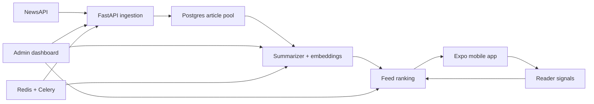

# The Edit

The Edit is a personalized mobile news briefing app with an operator dashboard.
It ingests fresh news, summarizes articles into compact cards, ranks editions for
each reader, and gives an admin a practical control room for running and
inspecting the content pipeline.

The project is built as a recruiter-friendly full-stack product: a React Native
reader app, a FastAPI data pipeline, background workers, and a private React
dashboard.

## User App

The mobile app is the reader-facing experience. Testers sign in with a beta
email/password, choose interests, and read swipeable news cards organized into
daily editions.

What the app supports:

- Email/password beta login with persisted session state.
- Interest selection by topics and regions.
- Personalized editions: Morning Brief, Midday Catch-Up, and Daily Digest.
- Swipeable story cards with headline, summary, image, source, and open action.
- Interaction signals: viewed, liked, disliked, saved, clicked, and dwell time.
- Saved stories screen for revisiting articles later.

## Admin Dashboard

The dashboard is the operator-facing experience. It is intentionally private and
requires an admin email listed in `ADMIN_EMAILS`.

What the dashboard supports:

- Pipeline controls for ingestion, summarization, and full content refreshes.
- Health overview for article supply, summaries, embeddings, users, and coverage.
- Article pool filters by market, category, source, date, image status, and user signals.
- User management for creating beta accounts.
- Per-user feed inspection with ranking reasons, card state, and embedding status.
- Recent pipeline run history with fetched, inserted, summarized, embedded, and failure counts.

## How It Works



1. The backend fetches recent articles by country and category.
2. Articles are cleaned, deduplicated, categorized, and stored in Postgres.
3. Pending articles are summarized with OpenAI when configured, with a local fallback for development.
4. Embeddings are stored when available for semantic ranking.
5. Feeds are ranked per user and persisted as stable daily editions.
6. Reader interactions are logged and used to improve future ranking.

## Tech Stack

- **Mobile:** Expo, React Native, TypeScript, Expo Router.
- **Dashboard:** React, TypeScript, Vite.
- **Backend:** FastAPI, SQLAlchemy, Alembic, Pydantic.
- **Jobs:** Celery, Redis.
- **Data:** Postgres.
- **AI/content:** NewsAPI, OpenAI summaries and embeddings, deterministic fallback summaries.
- **Tests:** Pytest for backend contracts, ranking, feed editions, and summarizer behavior.

## Repository Layout

```text
backend/    FastAPI API, database models, Celery tasks, ranking, summarization
frontend/   Expo mobile reader app
dashboard/  React admin dashboard
docs/       Extra technical and operating notes
```

## Visual Overview

The diagram above shows the full product loop: operator-run ingestion and
summarization, persisted ranked editions, a mobile reader, and feedback signals
that feed future ranking. Product screenshots should be added under
`docs/assets/` when final app branding is ready.

Recommended screenshot set:

- Mobile briefing
- Saved stories
- Admin overview
- User feed inspector

## Local Setup

Clone the repo and create env files:

```bash
cp backend/.env.example backend/.env
cp dashboard/.env.example dashboard/.env
cp frontend/.env.example frontend/.env
```

Fill `backend/.env` with local secrets. At minimum:

```bash
SECRET_KEY="dev-change-me"
NEWS_API_KEY="your_newsapi_key"
ADMIN_EMAILS="admin@example.com"
ADMIN_BOOTSTRAP_EMAIL="admin@example.com"
ADMIN_BOOTSTRAP_PASSWORD="ChangeMe123"
ENABLE_PUBLIC_SIGNUP="false"
```

The bootstrap admin user is created or updated when the backend starts.

## Run The Backend

```bash
cd backend
docker compose up --build -d
docker compose exec web alembic upgrade head
docker compose exec web python app/db/scripts/initial_data.py
```

Useful local API URLs:

- API health: `http://localhost:8000/health`
- API docs: `http://localhost:8000/docs`

## Run The Dashboard

Set `dashboard/.env`:

```bash
VITE_API_BASE_URL="http://localhost:8000"
```

Then start it:

```bash
npm --prefix dashboard install
npm --prefix dashboard run dev
```

Sign in with the bootstrap admin email/password. Use Control -> Beta User to
create tester accounts. Public signup is disabled by default.

## Run The Mobile App

Set `frontend/.env`:

```bash
EXPO_PUBLIC_API_BASE_URL="http://localhost:8000"
```

Then start Expo:

```bash
npm --prefix frontend install
npm --prefix frontend run start
```

For a physical-phone beta, build with `EXPO_PUBLIC_API_BASE_URL` pointing to a
deployed HTTPS backend or stable tunnel.

## Testing

Backend:

```bash
cd backend
env PYTHONPATH=. ./.venv/bin/pytest
```

Frontend:

```bash
cd frontend
npm run lint
npx tsc --noEmit
```

Dashboard:

```bash
cd dashboard
npm run build
```

Note: Vite may warn if local Node is below its preferred version. The project
should be run with Node 20.19+ for dashboard builds.

## Why This Project Is Useful

The Edit demonstrates a realistic product loop rather than a static demo:

- It has a user-facing app and an operator-facing dashboard.
- It handles background jobs, third-party APIs, persistence, auth, and admin tooling.
- It turns messy external news data into a constrained mobile experience.
- It records feedback signals that can support future ranking and ML experiments.
- It is designed for a controlled beta, with quota limits and private admin access.

## Current Limitations

- NewsAPI plan limits make this suitable for controlled beta use, not public production traffic.
- Ranking is heuristic until there is enough interaction data for stronger personalization.
- Product screenshots and final app branding should be added before a polished GitHub share.
- Google login is intentionally disabled unless OAuth client IDs are configured.

## Extra Notes

See [docs/EXTRA_INFORMATION.md](docs/EXTRA_INFORMATION.md) for operating model,
ranking details, quota controls, deployment notes, and future improvements.
