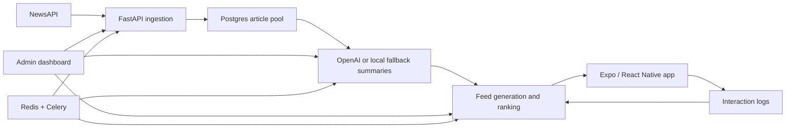

# Personalized News Summarizer

Personalized News Summarizer is a beta-ready news pipeline and mobile reader. The backend ingests headlines, deduplicates and summarizes articles, builds personalized 100-card feeds, and logs user interactions for later ranking work. A private admin dashboard controls pipeline runs, and an Expo app gives testers an email/password beta flow.

## Architecture



## Project Layout

- `backend/`: FastAPI API, SQLAlchemy models, Alembic migrations, Celery tasks, NewsAPI/OpenAI pipeline, admin endpoints.
- `dashboard/`: Vite/React admin dashboard for overview metrics, pipeline runs, article pool, users, and schedules.
- `frontend/`: Expo/React Native mobile app for account setup, interests, feed cards, saved articles, and interaction logging.
- `docs/`: architecture, beta runbook, deployment, quota strategy, and ranking/data notes.

## Screenshots

Add screenshots before sharing with recruiters:

- `docs/assets/mobile-onboarding.png`
- `docs/assets/mobile-feed.png`
- `docs/assets/admin-overview.png`
- `docs/assets/pipeline-runs.png`

Recommended demo assets: a 60-90 second screen recording showing account setup, 100-card feed, admin overview, and pipeline runs.

## Local Setup

```bash
cd /Users/ananyasrivastava/Desktop/Projects/news
cp backend/.env.example backend/.env
cp dashboard/.env.example dashboard/.env
cp frontend/.env.example frontend/.env
```

Fill `backend/.env` with local-only secrets. Do not commit real `.env` files.

## Backend Setup

```bash
cd /Users/ananyasrivastava/Desktop/Projects/news/backend
docker compose up --build -d
docker compose exec web alembic upgrade head
docker compose exec web python app/db/scripts/initial_data.py
```

Create an admin user whose email is in `ADMIN_EMAILS`:

```bash
curl -X POST http://localhost:8000/api/users/ \
  -H "Content-Type: application/json" \
  -d '{"email":"your@email.com","password":"replace-this"}'
```

## Dashboard Setup

```bash
cd /Users/ananyasrivastava/Desktop/Projects/news
npm --prefix dashboard install
npm --prefix dashboard run dev
```

Set `dashboard/.env`:

```bash
VITE_API_BASE_URL="http://localhost:8000"
```

Use `Full pipeline` and `Ingest` only when you intend to spend NewsAPI/OpenAI quota.

## Expo App Setup

```bash
cd /Users/ananyasrivastava/Desktop/Projects/news
npm --prefix frontend install
npm --prefix frontend run start
```

Set `frontend/.env` for local or deployed API:

```bash
EXPO_PUBLIC_API_BASE_URL="http://localhost:8000"
```

For beta builds, set it to your deployed HTTPS backend, for example:

```bash
EXPO_PUBLIC_API_BASE_URL="https://your-api.example.com"
```

Google login is disabled unless public Google OAuth client IDs are configured. Email/password is the recommended controlled beta path.

## Beta Access Flow

1. Tester fills a Google Form with name, email, platform, country, interests, and consent for usage signal collection.
2. Operator creates credentials through `/api/users/` or a small CSV/script workflow.
3. Operator emails the install link, email, password, known limitations, feedback form, and privacy note.
4. Tester logs in, picks interests, receives up to `FEED_SIZE=100` personalized cards, and uses the app.
5. Interactions are stored for later ranking analysis.

CSV format for manual beta account creation:

```csv
email,password
tester@example.com,replace-this
```

## Deployment Notes

Recommended minimal beta deployment:

- FastAPI API service
- Postgres database
- Redis
- Celery worker
- Optional Celery beat, or manual pipeline runs from the dashboard
- Admin dashboard protected by backend login and `ADMIN_EMAILS`
- Expo/EAS build with `EXPO_PUBLIC_API_BASE_URL` pointing to the deployed API

Good providers: Render, Railway, Fly.io, or a VPS. See [docs/DEPLOYMENT.md](/Users/ananyasrivastava/Desktop/Projects/news/docs/DEPLOYMENT.md).

## Cost And Quota Strategy

Beta defaults are intentionally bounded:

- `NEWS_API_PAGE_SIZE=100`
- `NEWS_DAILY_ARTICLE_TARGET=250`
- `ARTICLE_POOL_LIMIT=1000`
- `FEED_SIZE=100`
- `MAX_FEED_ITEMS=500`
- `OPENAI_DAILY_SUMMARY_LIMIT=250`

Run ingestion/summarization manually during beta unless you are actively monitoring quotas. See [docs/COST_AND_QUOTAS.md](/Users/ananyasrivastava/Desktop/Projects/news/docs/COST_AND_QUOTAS.md).

## Known Limitations

- NewsAPI Developer plan is not suitable for public production traffic.
- Ranking is intentionally heuristic until enough interaction data exists.
- Admin dashboard should be deployed privately or behind auth/network restrictions.
- Google OAuth requires platform-specific client IDs before enabling.
- Privacy policy and retention language should be finalized before wider public use.

## More Docs

- [Architecture](/Users/ananyasrivastava/Desktop/Projects/news/docs/ARCHITECTURE.md)
- [Beta Runbook](/Users/ananyasrivastava/Desktop/Projects/news/docs/BETA_RUNBOOK.md)
- [Deployment](/Users/ananyasrivastava/Desktop/Projects/news/docs/DEPLOYMENT.md)
- [Cost and Quotas](/Users/ananyasrivastava/Desktop/Projects/news/docs/COST_AND_QUOTAS.md)
- [Data and Ranking](/Users/ananyasrivastava/Desktop/Projects/news/docs/DATA_AND_RANKING.md)
