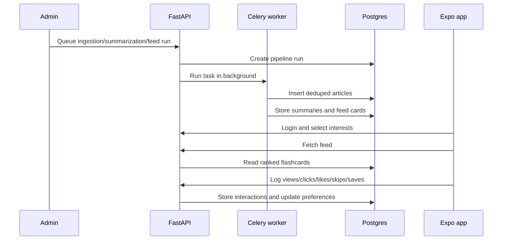

# Architecture

## Components

- **FastAPI backend**: auth, user profiles, interest selection, feed reads, interaction writes, admin APIs, and task triggers.
- **Postgres**: users, interests, article pool, summaries, flashcards, pipeline runs, schedules, and interaction logs.
- **Redis + Celery**: background ingestion, summarization, embeddings, and feed generation.
- **Admin dashboard**: private operator UI for pipeline runs, article pool visibility, user feed inspection, and scheduler setup.
- **Expo app**: beta tester experience for login, interest selection, 100-card feed, saves, clicks, likes, skips, and profile stats.

## Data Flow

## Beta Operating Model

During controlled beta, the mobile app should not trigger expensive ingestion. The operator runs pipeline actions from the dashboard, verifies article and summary counts, then testers consume already-generated feeds.

Recommended run order:

1. Ingest articles.
2. Summarize pending articles.
3. Generate feeds.
4. Inspect dashboard overview and a test user feed.
5. Share or continue beta session.

## Key Tables

- `users`, `user_interests`
- `articles`, `summaries`
- `flashcards`
- `user_article_interactions`
- `user_category_preferences`, `user_keyword_preferences`, `user_embedding_profiles`
- `pipeline_runs`, `pipeline_run_logs`, `pipeline_schedules`
- `summary_reviews`

## Public Repo Notes

The code can be public if real secrets stay out of git and deployed admin/dashboard access is protected. Keep `.env` files untracked, use provider secret stores, and review CORS/admin settings before deployment.
